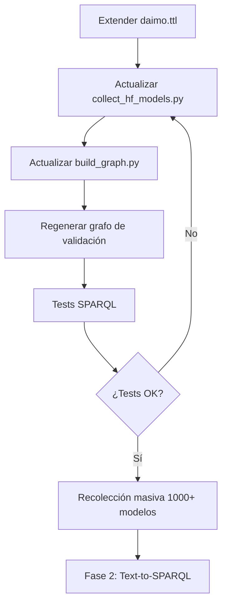

# 🚀 Plan de Implementación - Extensión de Metadatos

**Proyecto**: AI Model Discovery System  
**Fase**: Pre-Fase 2 (Enriquecimiento de Ontología)  
**Estado**: Planificación

---

## 📋 Checklist de Implementación

### ✅ Sprint 1: Metadatos Críticos (1-2 días)

- [ ] **1.1. Extender ontología DAIMO**
  - [ ] Añadir clase `daimo:ModelArchitecture`
  - [ ] Añadir clase `daimo:AccessPolicy`
  - [ ] Añadir propiedades: `daimo:hasArchitecture`, `daimo:accessControl`, `daimo:requiresApproval`
  - [ ] Validar sintaxis con `rapper` o Protégé

- [ ] **1.2. Actualizar colector HuggingFace**
  - [ ] Extraer `model_type` y `architectures` del `config`
  - [ ] Extraer `gated` y tipo de gatekeeping
  - [ ] Extraer `safetensors.parameters` para conteo
  - [ ] Añadir manejo de errores robusto
  
- [ ] **1.3. Actualizar graph builder**
  - [ ] Mapear `architectures` → `daimo:hasArchitecture`
  - [ ] Mapear `gated` → `daimo:AccessPolicy`
  - [ ] Añadir `daimo:parameterCount`
  
- [ ] **1.4. Validación**
  - [ ] Regenerar grafo con 50 modelos
  - [ ] Consultas SPARQL de validación
  - [ ] Verificar nuevos triples

---

### 🔸 Sprint 2: Evaluación y Performance (2-3 días)

- [ ] **2.1. Extender ontología**
  - [ ] Integrar `mls:ModelEvaluation` de ML-Schema
  - [ ] Añadir `daimo:fineTunedFrom`
  - [ ] Añadir `daimo:parameterCount` (si no se hizo en Sprint 1)

- [ ] **2.2. Actualizar colector**
  - [ ] Extraer `metrics` del card_data
  - [ ] Extraer `model-index` (eval_results)
  - [ ] Extraer `base_model`
  - [ ] Parsear resultados de benchmarks

- [ ] **2.3. Actualizar graph builder**
  - [ ] Crear nodos `mls:ModelEvaluation` por cada métrica
  - [ ] Mapear `base_model` → `daimo:fineTunedFrom`
  - [ ] Añadir valores de evaluación

- [ ] **2.4. Validación**
  - [ ] Consultas SPARQL avanzadas (filtrar por accuracy, etc.)
  - [ ] Verificar proveniencia de fine-tuning

---

### 🔹 Sprint 3: Contexto Técnico (1-2 días)

- [ ] **3.1. Extender ontología**
  - [ ] Añadir `daimo:HyperparameterConfiguration`
  - [ ] Añadir `daimo:hasConfiguration`
  - [ ] Añadir `daimo:usedByApplication`

- [ ] **3.2. Actualizar colector**
  - [ ] Extraer `config` completo (como JSON string o dict)
  - [ ] Extraer lista de `spaces`
  - [ ] Extraer `tokenizer_config` (opcional)

- [ ] **3.3. Actualizar graph builder**
  - [ ] Serializar `config` como JSON-LD o string
  - [ ] Mapear `spaces` → `foaf:Project` + `daimo:usedByApplication`

---

### 🔹 Sprint 4: Opcionales (1 día)

- [ ] **4.1. Sostenibilidad**
  - [ ] `daimo:carbonFootprint` → `co2_eq_emissions`
  
- [ ] **4.2. Inferencia**
  - [ ] `daimo:inferenceEndpoint` → `inference`

---

## 🧪 Tests y Validación

### Consultas SPARQL de Validación

```sparql
# Test 1: Modelos por arquitectura
PREFIX daimo: <http://purl.org/pionera/daimo#>
SELECT ?model ?arch WHERE {
  ?model daimo:hasArchitecture ?archNode .
  ?archNode rdfs:label ?arch .
}

# Test 2: Modelos gated
PREFIX daimo: <http://purl.org/pionera/daimo#>
SELECT ?model ?gated WHERE {
  ?model daimo:requiresApproval ?gated .
  FILTER(?gated = true)
}

# Test 3: Modelos por número de parámetros
PREFIX daimo: <http://purl.org/pionera/daimo#>
SELECT ?model ?params WHERE {
  ?model daimo:parameterCount ?params .
  FILTER(?params > 1000000000)  # > 1B parámetros
}
ORDER BY DESC(?params)

# Test 4: Modelos fine-tuneados
PREFIX daimo: <http://purl.org/pionera/daimo#>
SELECT ?model ?base WHERE {
  ?model daimo:fineTunedFrom ?base .
}

# Test 5: Modelos con evaluación > 0.9
PREFIX mls: <http://www.w3.org/ns/mls#>
SELECT ?model ?metric ?value WHERE {
  ?model mls:hasEvaluation ?eval .
  ?eval mls:specifiedBy ?metric .
  ?eval mls:hasValue ?value .
  FILTER(?value > 0.9)
}
```

---

## 📊 Métricas de Éxito

| Métrica | Baseline Actual | Objetivo Post-Extensión |
|---------|----------------|------------------------|
| Campos capturados por modelo | ~12 | ~25 |
| Triples por modelo | ~40 | ~80-100 |
| Clases DAIMO | 2-3 | 6-8 |
| Propiedades DAIMO | ~10 | ~20 |
| Cobertura de metadatos críticos | 60% | 95% |

---

## 🚦 Criterios de Aceptación

### Para proceder a Fase 2, debe cumplirse:

1. ✅ **Ontología DAIMO extendida** con al menos las clases/propiedades del Sprint 1 + 2
2. ✅ **Colector HuggingFace** captura todos los campos de Nivel 1 + 2 (25 campos)
3. ✅ **Graph builder** mapea correctamente los nuevos campos
4. ✅ **Validación exitosa** de las 5 consultas SPARQL de test
5. ✅ **Documentación actualizada** del mapeo ontológico
6. ✅ **Grafo de prueba** con 100+ modelos enriquecidos

---

## 🔄 Flujo de Trabajo



---

## 📝 Notas de Implementación

### Consideraciones Técnicas

1. **Manejo de None/null**: Muchos campos opcionales pueden estar ausentes
2. **Parseo de config**: `config` puede ser muy grande; considerar almacenar solo keys relevantes
3. **Evaluaciones múltiples**: Un modelo puede tener múltiples evaluaciones en diferentes datasets
4. **Versiones de modelo**: Hugging Face permite múltiples versiones (commits); por ahora capturamos solo la última

### Optimizaciones

- **Batch processing**: Procesar modelos en lotes para evitar timeouts
- **Caché**: Guardar respuestas de API para evitar re-consultas
- **Rate limiting**: Respetar límites de Hugging Face API

---

## 🎯 Entrega Final

**Artefactos esperados**:
1. `ontologies/daimo.ttl` (extendido)
2. `utils/collect_hf_models.py` (v2 con 25 campos)
3. `knowledge_graph/build_graph.py` (v2 con nuevo mapeo)
4. `data/processed/kg_enriched.ttl` (grafo enriquecido)
5. `docs/ONTOLOGY_MAPPING.md` (tabla completa de mapeo)
6. `tests/test_enriched_queries.py` (tests automatizados)

**Timeline estimado**: 5-7 días de trabajo

**Siguiente milestone**: Iniciar Fase 2 con ontología robusta y metadatos completos
