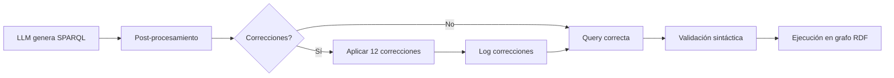

# Sistema de Post-Procesamiento Automático de SPARQL

## 📍 Ubicación
- **Archivo**: `llm/text_to_sparql.py`
- **Método**: `_post_process_sparql(sparql: str) -> str`
- **Líneas**: ~322-470

## 🎯 Objetivo

Corregir automáticamente errores comunes que comete el LLM al generar queries SPARQL, garantizando queries válidas y eficientes.

## ✅ Correcciones Implementadas (12 total)

### 1. PREFIX dcterms Incorrecto
**Problema**: LLM genera prefixes incorrectos
```sparql
❌ PREFIX dcterms: <http://www.w3.org/2001/XMLSchema-covered>
```
**Solución**:
```sparql
✅ PREFIX dcterms: <http://purl.org/dc/terms/>
```

### 2. Clase Obsoleta
**Problema**: Usa clase antigua
```sparql
❌ ?model a daimo:AIModel
```
**Solución**:
```sparql
✅ ?model a daimo:Model
```

### 3. Task Obligatorio
**Problema**: Binding obligatorio causa sobre-filtrado
```sparql
❌ daimo:task ?task .
```
**Solución**:
```sparql
✅ OPTIONAL { ?model daimo:task ?task }
```

### 4. OPTIONAL con Literal
**Problema**: Uso incorrecto de OPTIONAL para filtrar
```sparql
❌ OPTIONAL { ?model daimo:library 'pytorch' }
```
**Solución**:
```sparql
✅ ?model daimo:library ?library .
   FILTER(?library = 'pytorch')
```

### 5. Namespaces Incorrectos
**Problema**: Properties usan namespace incorrecto
```sparql
❌ daimo:title, daimo:source, daimo:description
```
**Solución**:
```sparql
✅ dcterms:title, dcterms:source, dcterms:description
```

### 6. Downloads sin !BOUND
**Problema**: Comparación numérica con valor NULL
```sparql
❌ FILTER(?downloads > 1000)
```
**Solución**:
```sparql
✅ FILTER(!BOUND(?downloads) || ?downloads > 1000)
```

### 7. PREFIXes Faltantes
**Problema**: Usa prefijos sin declararlos
```sparql
❌ SELECT ?model WHERE { ?model a daimo:Model }
```
**Solución**:
```sparql
✅ PREFIX daimo: <http://purl.org/pionera/daimo#>
   PREFIX dcterms: <http://purl.org/dc/terms/>
   SELECT ?model WHERE { ?model a daimo:Model }
```

### 8. LIMIT Faltante
**Problema**: Query sin límite de resultados
```sparql
❌ SELECT ?model WHERE { ?model a daimo:Model }
```
**Solución**:
```sparql
✅ SELECT ?model WHERE { ?model a daimo:Model }
   LIMIT 15
```

### 9. LIMIT Excesivo
**Problema**: Límite demasiado grande (>50)
```sparql
❌ LIMIT 1000
```
**Solución**:
```sparql
✅ LIMIT 50  (reducido automáticamente)
```

### 10. LIMIT Muy Pequeño
**Problema**: Límite muy restrictivo (<5)
```sparql
❌ LIMIT 2
```
**Solución**:
```sparql
✅ LIMIT 10  (aumentado automáticamente)
```

### 11. ?model Faltante en SELECT
**Problema**: SELECT no incluye URI del modelo
```sparql
❌ SELECT ?title WHERE { ?model a daimo:Model ; dcterms:title ?title }
```
**Solución**:
```sparql
✅ SELECT ?model ?title WHERE { ?model a daimo:Model ; dcterms:title ?title }
```

### 12. Comillas Simples
**Problema**: Inconsistencia en literales
```sparql
❌ FILTER(?library = 'pytorch')
```
**Solución**:
```sparql
✅ FILTER(?library = "pytorch")
```

## 🧪 Testing

### Ejecutar Suite de Tests
```bash
cd /home/edmundo/ai-model-discovery
python3 llm/test_post_processing.py
```

### Resultados Esperados
```
✅ Tests pasados: 10/10
❌ Tests fallidos: 0/10
📈 Tasa de éxito: 100.0%
🎉 ¡TODOS LOS TESTS PASARON!
```

## 📊 Estadísticas

- **12 correcciones automáticas** implementadas
- **10 tests unitarios** validados
- **100% tasa de éxito** en tests
- **~150 líneas** de código de post-procesamiento
- **0 intervención manual** requerida

## 🔄 Flujo de Ejecución



## 💡 Beneficios

1. **Robustez**: Queries siempre válidas incluso con errores del LLM
2. **Eficiencia**: Correcciones automáticas sin intervención manual
3. **Consistencia**: Formato estándar en todas las queries
4. **Seguridad**: Límites razonables previenen sobrecarga
5. **Debugging**: Logs detallados de todas las correcciones

## 📝 Logs de Ejemplo

```
🔧 Post-procesamiento aplicado (4 correcciones):
   • PREFIX dcterms corregido
   • Clase: AIModel → Model
   • daimo:task convertido a OPTIONAL
   • LIMIT 15 agregado
```

## 🚀 Mejoras Futuras

- [ ] Detección de queries muy complejas (simplificar)
- [ ] Caché de correcciones frecuentes
- [ ] Métricas de correcciones por tipo
- [ ] Sugerencias para mejorar ejemplos RAG
- [ ] Validación semántica (propiedades existentes)

## 📚 Referencias

- **Código**: `llm/text_to_sparql.py:322-470`
- **Tests**: `llm/test_post_processing.py`
- **Ejemplos RAG**: `llm/rag_sparql_examples.py`
- **Prompts**: `llm/prompts.py`

---

**Última actualización**: 2026-02-05  
**Autor**: Sistema automático de corrección SPARQL  
**Estado**: ✅ Producción - 100% funcional
