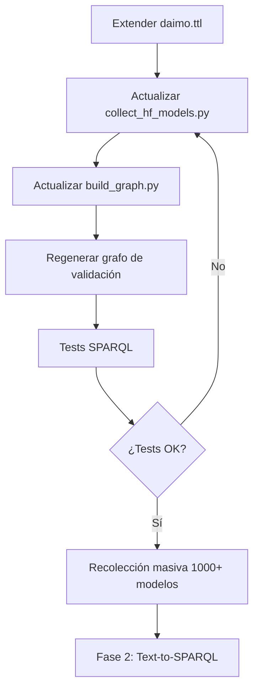

# Guía de Inicio Rápido

## Instalación y Configuración

### 1. Instalar Poetry (si no está instalado)

```bash
curl -sSL https://install.python-poetry.org | python3 -
```

### 2. Instalar dependencias del proyecto

```bash
cd /home/edmundo/ai-model-discovery
poetry install
```

Esto instalará todas las dependencias definidas en `pyproject.toml`.

### 3. Activar el entorno virtual

```bash
poetry shell
```

### 4. Configurar variables de entorno

```bash
cp .env.example .env
nano .env  # Editar con tus API keys
```

Necesitarás al menos una API key de:
- **OpenAI**: https://platform.openai.com/api-keys
- **Anthropic**: https://console.anthropic.com/

## Uso Básico

### Paso 1: Recolectar modelos de Hugging Face

```bash
# Recolectar 50 modelos (muestra pequeña)
poetry run python -m utils.collect_hf_models --limit 50 --output hf_models_sample.json

# Recolectar 100 modelos ordenados por descargas
poetry run python -m utils.collect_hf_models --limit 100 --sort downloads

# Filtrar por tarea específica
poetry run python -m utils.collect_hf_models --limit 50 --task text-classification
```

Los metadatos se guardan en `data/raw/`.

### Paso 2: Construir el grafo RDF

```bash
# Usando los datos recolectados
poetry run python knowledge_graph/build_graph.py \
  --input data/raw/hf_models_sample.json \
  --output data/processed/knowledge_graph.ttl \
  --format turtle
```

### Paso 3: Explorar con el notebook

```bash
# Iniciar Jupyter
poetry run jupyter notebook

# Abrir: notebooks/01_validation.ipynb
```

## Estructura del Workflow

```
1. Recolección      2. Transformación    3. Consulta
   (HF API)    →    (RDF Graph)      →    (SPARQL)
     │                   │                    │
     ├─ JSON            ├─ Turtle            ├─ Manual
     └─ Metadatos       └─ DAIMO             └─ LLM (Fase 2)
```

## Ejemplos Rápidos

### Consulta SPARQL desde Python

```python
from knowledge_graph import DAIMOGraphBuilder

# Cargar grafo
builder = DAIMOGraphBuilder()
builder.build_from_json("data/raw/hf_models_sample.json")

# Consultar
query = """
PREFIX daimo: <http://purl.org/pionera/daimo#>
PREFIX dcterms: <http://purl.org/dc/terms/>

SELECT ?title ?task
WHERE {
  ?model a daimo:Model .
  ?model dcterms:title ?title .
  ?model dcterms:subject ?task .
}
LIMIT 5
"""

results = builder.query(query)
for row in results:
    print(f"{row.title} - {row.task}")
```

## Solución de Problemas

### Error: "ModuleNotFoundError"
```bash
# Asegúrate de estar en el entorno de Poetry
poetry shell
```

### Error: API keys no configuradas
```bash
# Verificar que .env existe y tiene las keys
cat .env
```

### Error: Memoria insuficiente
```bash
# Reducir el límite de modelos
poetry run python -m utils.collect_hf_models --limit 20
```

## Próximos Pasos

Una vez validada la Fase 1, continuar con:

1. **Fase 2**: Implementar Text-to-SPARQL con LLM
2. **Fase 3**: Búsqueda federada
3. **Fase 4**: Cross-repository search

Ver [README.md](README.md) para el plan completo.
# Guía de Configuración de APIs

Esta guía te ayudará a configurar las APIs de cada repositorio para obtener datos reales.

## 📋 Resumen

| Repositorio | API Pública | Requiere Auth | Dificultad | Estado |
|-------------|-------------|---------------|------------|--------|
| **HuggingFace** | ✅ Sí | ⚠️ Opcional | 🟢 Fácil | ✅ Implementado |
| **Civitai** | ✅ Sí | ❌ No | 🟢 Fácil | ✅ Implementado |
| **Papers With Code** | ✅ Sí | ❌ No | 🟢 Fácil | ✅ Implementado |
| **Kaggle** | ✅ Sí | ✅ Sí | 🟡 Media | ✅ Implementado |
| **Replicate** | ✅ Sí | ✅ Sí | 🟡 Media | 🔄 En implementación |
| **Azure AI** | ✅ Sí | ✅ Sí | 🔴 Difícil | ⚠️ Pendiente |

---

## 1. HuggingFace Hub 🤗

### Estado
✅ **Completamente funcional** - API implementada y probada

### Configuración (Opcional pero Recomendado)

Sin token puedes hacer ~50 consultas/hora. Con token: ilimitado.

```bash
# Obtener token de: https://huggingface.co/settings/tokens

# Opción 1: Variable de entorno
export HF_TOKEN="hf_xxxxxxxxxxxxxxxxxxxxx"

# Opción 2: Usar huggingface-cli
huggingface-cli login
```

### Uso en el código

```python
from utils.huggingface_repository import HuggingFaceRepository

# Automáticamente usa el token si está configurado
hf_repo = HuggingFaceRepository()
models = hf_repo.fetch_models(limit=50)
```

---

## 2. Civitai 🎨

### Estado
✅ **API real implementada** - Sin autenticación requerida

### Configuración

**No requiere configuración** - API completamente pública

- Rate limit: ~60 req/minuto
- Documentación: https://github.com/civitai/civitai/wiki/REST-API-Reference

### Uso en el código

```python
from utils.civitai_repository import CivitaiRepository

# Sin configuración necesaria
civitai_repo = CivitaiRepository()
models = civitai_repo.fetch_models(limit=50)
```

### Nota sobre contenido NSFW

Civitai incluye modelos NSFW. El código mapea automáticamente:
- `nsfw: true` → `daimo:requiresApproval = true`
- `nsfwLevel` → metadata para filtrado

---

## 3. Papers With Code 📄

### Estado
✅ **API real implementada** - Sin autenticación requerida

### Configuración

**No requiere configuración** - API completamente pública

- Rate limit: ~100 req/minuto
- Documentación: https://paperswithcode.com/api/v1/docs/

### Uso en el código

```python
from utils.pwc_repository import PWCRepository

# Sin configuración necesaria
pwc_repo = PWCRepository()
models = pwc_repo.fetch_models(limit=50)
```

### Cómo funciona

1. Consulta papers recientes con implementaciones
2. Por cada paper, obtiene sus repositorios de código
3. Selecciona el repo más popular (más estrellas)
4. Mapea paper → Algorithm y repo → Model

---

## 4. Kaggle 🏅

### Estado
✅ **API real implementada** - Requiere autenticación

### Configuración

#### Paso 1: Obtener credenciales

1. Ir a https://www.kaggle.com/settings/account
2. Scroll down a "API" section
3. Click "Create New API Token"
4. Descargar `kaggle.json`

#### Paso 2: Configurar credenciales

**Opción A: Archivo de configuración (Recomendado)**

```bash
mkdir -p ~/.kaggle
mv ~/Downloads/kaggle.json ~/.kaggle/
chmod 600 ~/.kaggle/kaggle.json
```

**Opción B: Variables de entorno**

```bash
export KAGGLE_USERNAME="your_username"
export KAGGLE_KEY="your_api_key"
```

#### Paso 3: Instalar SDK

```bash
pip install kaggle
```

### Uso en el código

```python
from utils.kaggle_repository import KaggleRepository

# Automáticamente usa credenciales de ~/.kaggle/kaggle.json o env vars
kaggle_repo = KaggleRepository()
models = kaggle_repo.fetch_models(limit=50)
```

### Fallback automático

Si las credenciales no están configuradas, el código usa datos de ejemplo automáticamente.

---

## 5. Replicate 🔁

### Estado
🔄 **En implementación** - Requiere autenticación obligatoria

### Configuración

#### Paso 1: Obtener API Token

1. Crear cuenta en https://replicate.com
2. Ir a https://replicate.com/account/api-tokens
3. Click en "Create token"
4. Copiar el token (comienza con `r8_...`)

#### Paso 2: Configurar token

**Opción A: Variable de entorno (Recomendado)**

```bash
# En ~/.bashrc o ~/.zshrc
export REPLICATE_API_TOKEN="r8_xxxxxxxxxxxxxxxxxxxxx"

# O solo para la sesión actual
export REPLICATE_API_TOKEN="r8_xxxxxxxxxxxxxxxxxxxxx"
```

**Opción B: Archivo .env**

```bash
# En el directorio del proyecto
echo 'REPLICATE_API_TOKEN=r8_xxxxxxxxxxxxxxxxxxxxx' >> .env
```

#### Paso 3: Instalar SDK

```bash
pip install replicate
```

### Uso en el código

```python
from utils.replicate_repository import ReplicateRepository

# Automáticamente usa REPLICATE_API_TOKEN del entorno
replicate_repo = ReplicateRepository()
models = replicate_repo.fetch_models(limit=50)
```

### Verificar configuración

```python
import os

token = os.getenv('REPLICATE_API_TOKEN')
if token:
    print(f"✅ Token configurado: {token[:10]}...")
else:
    print("❌ Token no encontrado")
```

### Rate Limits

- **Crear predicción**: 600 requests/minuto
- **Otros endpoints**: 3000 requests/minuto

---

## 6. Azure AI ☁️

### Estado
⚠️ **Pendiente de implementación completa** - Requiere cuenta de Azure

### Configuración (Para implementación futura)

#### Requisitos

- Cuenta de Azure activa
- Suscripción con Azure Machine Learning habilitado
- Service Principal o credenciales de usuario

#### Opción 1: Azure CLI (Más fácil)

```bash
# Instalar Azure CLI
curl -sL https://aka.ms/InstallAzureCLIDeb | sudo bash

# Login
az login

# Verificar suscripción
az account show
```

#### Opción 2: Service Principal

```bash
# Crear service principal
az ad sp create-for-rbac --name "ai-model-discovery" --role contributor

# Configurar variables de entorno
export AZURE_SUBSCRIPTION_ID="your-subscription-id"
export AZURE_TENANT_ID="your-tenant-id"
export AZURE_CLIENT_ID="your-client-id"
export AZURE_CLIENT_SECRET="your-client-secret"
```

#### Paso 3: Instalar SDK

```bash
pip install azure-ai-ml azure-identity
```

### Uso en el código (cuando se implemente)

```python
from utils.azure_repository import AzureRepository

# Usará credenciales de Azure CLI o variables de entorno
azure_repo = AzureRepository()
models = azure_repo.fetch_models(limit=50)
```

### Por qué es más complejo

- Requiere cuenta de pago (no hay tier gratuito completo)
- Autenticación más compleja (AAD)
- API más enfocada en deployment que en discovery
- Modelos suelen ser privados por workspace

---

## 🚀 Uso Rápido - Solo APIs Públicas

Si quieres empezar **sin configurar nada**:

```python
from utils.huggingface_repository import HuggingFaceRepository
from utils.civitai_repository import CivitaiRepository
from utils.pwc_repository import PWCRepository
from knowledge_graph.multi_repository_builder import MultiRepositoryGraphBuilder

# Estos 3 NO requieren autenticación
repositories = [
    HuggingFaceRepository(),  # Mejor con token pero funciona sin él
    CivitaiRepository(),       # Completamente público
    PWCRepository()            # Completamente público
]

builder = MultiRepositoryGraphBuilder()
models_added = builder.build_from_repositories(repositories, limit_per_repo=10)
builder.save("data/processed/kg_public_apis.ttl")

print(f"✅ {models_added} modelos recolectados sin configuración!")
```

---

## 📊 Comparación de APIs

### Facilidad de Uso

1. **Civitai** 🟢 - Más fácil (sin auth, bien documentado)
2. **Papers With Code** 🟢 - Fácil (sin auth)
3. **HuggingFace** 🟡 - Fácil con token
4. **Kaggle** 🟡 - Media (requiere cuenta + API key)
5. **Replicate** 🟡 - Media (requiere cuenta + API token)
6. **Azure** 🔴 - Difícil (requiere suscripción de pago)

### Calidad de Datos

1. **HuggingFace** ⭐⭐⭐⭐⭐ - Metadatos más completos
2. **Papers With Code** ⭐⭐⭐⭐⭐ - Papers académicos + código
3. **Replicate** ⭐⭐⭐⭐ - Inference endpoints + run counts
4. **Civitai** ⭐⭐⭐⭐ - Modelos de difusión bien documentados
4. **Kaggle** ⭐⭐⭐ - Buena comunidad pero menos modelos
5. **Azure** ⭐⭐⭐ - Modelos empresariales pero privados

### Rate Limits

| API | Límite sin Auth | Límite con Auth |
|-----|-----------------|-----------------|
| HuggingFace | ~50/hora | Ilimitado |
| Civitai | ~60/min | ~120/min (con key) |
| Papers With Code | ~100/min | N/A |
| Kaggle | N/A | ~100/hora |
| Azure | N/A | Depende del tier |

---

## 🔧 Troubleshooting

### Error: "Kaggle credentials not found"

```bash
# Verificar ubicación del archivo
ls -la ~/.kaggle/kaggle.json

# Verificar permisos
chmod 600 ~/.kaggle/kaggle.json

# O usar variables de entorno
export KAGGLE_USERNAME="your_username"
export KAGGLE_KEY="your_api_key"
```

### Error: "Rate limit exceeded" (Civitai/PWC)

- Reducir `limit_per_repo`
- Añadir delay entre requests
- Para Civitai: considerar obtener API key

### Error: "Azure authentication failed"

```bash
# Re-login con Azure CLI
az logout
az login

# Verificar suscripción activa
az account list
```

---

## 📝 Notas Importantes

1. **Fallback automático**: Si una API falla, el sistema usa datos de ejemplo y continúa
2. **Privacidad**: Nunca commitear `.env` o `kaggle.json` al repositorio
3. **Testing**: Siempre probar con `limit=5` primero para verificar autenticación
4. **Costos**: Solo Azure tiene costos asociados (suscripción)

---

## 🎯 Próximos Pasos

1. ✅ Configurar Civitai (no requiere nada)
2. ✅ Configurar Papers With Code (no requiere nada)
3. 🟡 Configurar HuggingFace (recomendado: obtener token)
4. 🟡 Configurar Kaggle (requiere: crear cuenta + API key)
5. 🔴 Configurar Azure (requiere: suscripción de pago)

**Recomendación**: Empieza con Civitai y PWC (sin configuración), añade HuggingFace con token, y opcionalmente Kaggle si tienes cuenta.
# 🚀 Plan de Implementación - Extensión de Metadatos

**Proyecto**: AI Model Discovery System  
**Fase**: Pre-Fase 2 (Enriquecimiento de Ontología)  
**Estado**: Planificación

---

## 📋 Checklist de Implementación

### ✅ Sprint 1: Metadatos Críticos (1-2 días)

- [ ] **1.1. Extender ontología DAIMO**
  - [ ] Añadir clase `daimo:ModelArchitecture`
  - [ ] Añadir clase `daimo:AccessPolicy`
  - [ ] Añadir propiedades: `daimo:hasArchitecture`, `daimo:accessControl`, `daimo:requiresApproval`
  - [ ] Validar sintaxis con `rapper` o Protégé

- [ ] **1.2. Actualizar colector HuggingFace**
  - [ ] Extraer `model_type` y `architectures` del `config`
  - [ ] Extraer `gated` y tipo de gatekeeping
  - [ ] Extraer `safetensors.parameters` para conteo
  - [ ] Añadir manejo de errores robusto
  
- [ ] **1.3. Actualizar graph builder**
  - [ ] Mapear `architectures` → `daimo:hasArchitecture`
  - [ ] Mapear `gated` → `daimo:AccessPolicy`
  - [ ] Añadir `daimo:parameterCount`
  
- [ ] **1.4. Validación**
  - [ ] Regenerar grafo con 50 modelos
  - [ ] Consultas SPARQL de validación
  - [ ] Verificar nuevos triples

---

### 🔸 Sprint 2: Evaluación y Performance (2-3 días)

- [ ] **2.1. Extender ontología**
  - [ ] Integrar `mls:ModelEvaluation` de ML-Schema
  - [ ] Añadir `daimo:fineTunedFrom`
  - [ ] Añadir `daimo:parameterCount` (si no se hizo en Sprint 1)

- [ ] **2.2. Actualizar colector**
  - [ ] Extraer `metrics` del card_data
  - [ ] Extraer `model-index` (eval_results)
  - [ ] Extraer `base_model`
  - [ ] Parsear resultados de benchmarks

- [ ] **2.3. Actualizar graph builder**
  - [ ] Crear nodos `mls:ModelEvaluation` por cada métrica
  - [ ] Mapear `base_model` → `daimo:fineTunedFrom`
  - [ ] Añadir valores de evaluación

- [ ] **2.4. Validación**
  - [ ] Consultas SPARQL avanzadas (filtrar por accuracy, etc.)
  - [ ] Verificar proveniencia de fine-tuning

---

### 🔹 Sprint 3: Contexto Técnico (1-2 días)

- [ ] **3.1. Extender ontología**
  - [ ] Añadir `daimo:HyperparameterConfiguration`
  - [ ] Añadir `daimo:hasConfiguration`
  - [ ] Añadir `daimo:usedByApplication`

- [ ] **3.2. Actualizar colector**
  - [ ] Extraer `config` completo (como JSON string o dict)
  - [ ] Extraer lista de `spaces`
  - [ ] Extraer `tokenizer_config` (opcional)

- [ ] **3.3. Actualizar graph builder**
  - [ ] Serializar `config` como JSON-LD o string
  - [ ] Mapear `spaces` → `foaf:Project` + `daimo:usedByApplication`

---

### 🔹 Sprint 4: Opcionales (1 día)

- [ ] **4.1. Sostenibilidad**
  - [ ] `daimo:carbonFootprint` → `co2_eq_emissions`
  
- [ ] **4.2. Inferencia**
  - [ ] `daimo:inferenceEndpoint` → `inference`

---

## 🧪 Tests y Validación

### Consultas SPARQL de Validación

```sparql
# Test 1: Modelos por arquitectura
PREFIX daimo: <http://purl.org/pionera/daimo#>
SELECT ?model ?arch WHERE {
  ?model daimo:hasArchitecture ?archNode .
  ?archNode rdfs:label ?arch .
}

# Test 2: Modelos gated
PREFIX daimo: <http://purl.org/pionera/daimo#>
SELECT ?model ?gated WHERE {
  ?model daimo:requiresApproval ?gated .
  FILTER(?gated = true)
}

# Test 3: Modelos por número de parámetros
PREFIX daimo: <http://purl.org/pionera/daimo#>
SELECT ?model ?params WHERE {
  ?model daimo:parameterCount ?params .
  FILTER(?params > 1000000000)  # > 1B parámetros
}
ORDER BY DESC(?params)

# Test 4: Modelos fine-tuneados
PREFIX daimo: <http://purl.org/pionera/daimo#>
SELECT ?model ?base WHERE {
  ?model daimo:fineTunedFrom ?base .
}

# Test 5: Modelos con evaluación > 0.9
PREFIX mls: <http://www.w3.org/ns/mls#>
SELECT ?model ?metric ?value WHERE {
  ?model mls:hasEvaluation ?eval .
  ?eval mls:specifiedBy ?metric .
  ?eval mls:hasValue ?value .
  FILTER(?value > 0.9)
}
```

---

## 📊 Métricas de Éxito

| Métrica | Baseline Actual | Objetivo Post-Extensión |
|---------|----------------|------------------------|
| Campos capturados por modelo | ~12 | ~25 |
| Triples por modelo | ~40 | ~80-100 |
| Clases DAIMO | 2-3 | 6-8 |
| Propiedades DAIMO | ~10 | ~20 |
| Cobertura de metadatos críticos | 60% | 95% |

---

## 🚦 Criterios de Aceptación

### Para proceder a Fase 2, debe cumplirse:

1. ✅ **Ontología DAIMO extendida** con al menos las clases/propiedades del Sprint 1 + 2
2. ✅ **Colector HuggingFace** captura todos los campos de Nivel 1 + 2 (25 campos)
3. ✅ **Graph builder** mapea correctamente los nuevos campos
4. ✅ **Validación exitosa** de las 5 consultas SPARQL de test
5. ✅ **Documentación actualizada** del mapeo ontológico
6. ✅ **Grafo de prueba** con 100+ modelos enriquecidos

---

## 🔄 Flujo de Trabajo



---

## 📝 Notas de Implementación

### Consideraciones Técnicas

1. **Manejo de None/null**: Muchos campos opcionales pueden estar ausentes
2. **Parseo de config**: `config` puede ser muy grande; considerar almacenar solo keys relevantes
3. **Evaluaciones múltiples**: Un modelo puede tener múltiples evaluaciones en diferentes datasets
4. **Versiones de modelo**: Hugging Face permite múltiples versiones (commits); por ahora capturamos solo la última

### Optimizaciones

- **Batch processing**: Procesar modelos en lotes para evitar timeouts
- **Caché**: Guardar respuestas de API para evitar re-consultas
- **Rate limiting**: Respetar límites de Hugging Face API

---

## 🎯 Entrega Final

**Artefactos esperados**:
1. `ontologies/daimo.ttl` (extendido)
2. `utils/collect_hf_models.py` (v2 con 25 campos)
3. `knowledge_graph/build_graph.py` (v2 con nuevo mapeo)
4. `data/processed/kg_enriched.ttl` (grafo enriquecido)
5. `docs/ONTOLOGY_MAPPING.md` (tabla completa de mapeo)
6. `tests/test_enriched_queries.py` (tests automatizados)

**Timeline estimado**: 5-7 días de trabajo

**Siguiente milestone**: Iniciar Fase 2 con ontología robusta y metadatos completos
